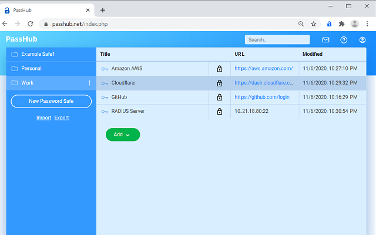
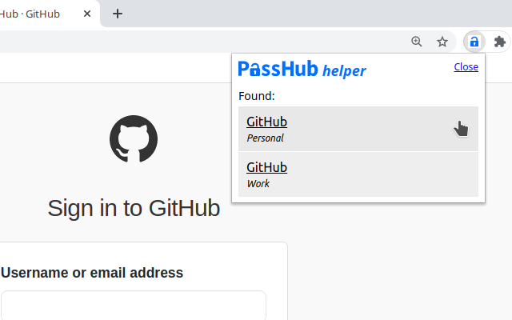

# Chrome extension for PassHub

The extension is a helper tool for the PassHub.net web site. 

PassHub.net is a stand-alone web password manager. PassHub employs WWPass technology for strong multi-factor authentication (MFA) and client-side encryption. PassHub features credentials, notes, and file storage combined with fine-grained sharing capabilities. PassHub interface resembles well-known KeePass architecture. In addition, PassHub is fully export/import compatible with KeePass, the password manager of choice for IT professionals. 

The **PassHub Chrome extension** is a non-intrusive intelligent tool to fill username/password fields in login forms.

By no means the extension is a silver bullet, rather it is a semi-manual tool to select approprite account and fill usernames and passwords into login forms on web sites. 

## Requirements

The extension works in the presence of PassHub.net tab, user should be signed in.

## How to use

1. Login to PassHub 

2. Open Login page of the target web site and click Extension Logo in the upper right corner. Choose a desired account. When login form is filled, click "Sign in" button.

## Compaibility

The extension works not only with Chrome but with any Chromium-based browser: Microsoft Edge, Vivaldi, Opera, Brave, etc.   

Particularly we checked the following list:

- Windows Chrome
- Windows Opera
- Windows Edge
- Windows Vivaldi

- Linux Chrome
- Macintosh Chrome

## License

This project is licensed under the GPLv3 License - see the LICENSE.md file for details

