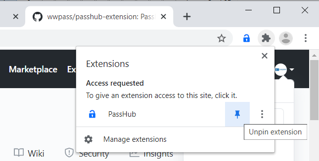

# Chrome extension for PassHub

The extension is a helper tool for the [PassHub.net](https://passhub.net) web password manager. 

PassHub employs [WWPass](https://www.wwpass.com/) technology for strong multi-factor authentication (MFA) and client-side encryption. PassHub features credentials, notes, and file storage combined with fine-grained sharing capabilities. PassHub interface resembles well-known KeePass user experience. In addition, PassHub is fully export/import compatible with KeePass, the password manager of choice for IT professionals. 

The **PassHub Chrome extension** is a non-intrusive tool to fill username/password fields in login forms.

By no means the extension is a silver bullet, rather it is a semi-manual tool to select the appropriate account and fill usernames and passwords into login forms on web sites. 

## Installation

On Chrome, Microsoft Edge, Opera, Vivaldi, and other Chromium-based use [Chrome Web Store](https://chrome.google.com/webstore/detail/passhub/bamjbfhfacpdkenilcibkmpdahkgfejh).

Chrome browser only: pin PassHub extension icon to the Chrome Toolbar. Click the puzzle piece-shaped Extensions icon next to account icon and then choose find pushpin icon for PassHub extension. 

## Requirements

The extension works in the presence of PassHub.net tab, a user should be signed in.

## How to use

1. Log in to PassHub 

2. Open the Login page of the target web site and click PassHub Logo in the upper right corner. Choose the desired account. When the login form is filled, click the "Sign in" button of the form.

## Compatibility

The extension works not only with Chrome but with any Chromium-based browser: Microsoft Edge, Vivaldi, Opera, Brave, etc.   

Particularly we checked the following list:

- Windows Chrome
- Windows Opera
- Windows Edge
- Windows Vivaldi

- Linux Chrome
- Macintosh Chrome

## License

This project is licensed under the GPLv3 License - see the LICENSE.md file for details
